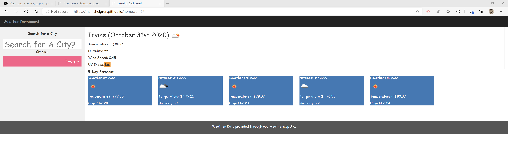

# Weather Dashboard

This is a single function web page that calls a free, open API to retrieve the current weather and weather forecast for cities entered by the user one city at a time.

The results include the current weather and the next five days forecast.

The cities the user has entered are displayed in a drop down list. The user can enter a city into the prompt area or select a city from the drop down list.

The list of cities are saved in local storage so that when the user leaves the page or restarts the page it will display the weather results for the last city being viewed when the page was exited.

The following is a url to the page that can be executed.
https://markshelgren.github.io/homework6/

The following is a url to the Github repository.
https://github.com/markshelgren/homework6

